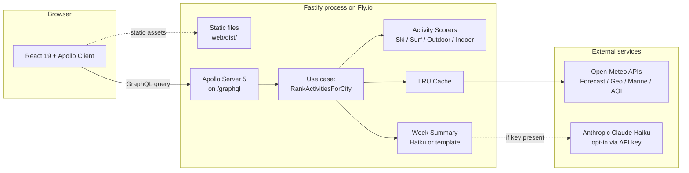

# 00 — Overview

## Purpose

Build a well-structured, scalable web application that accepts a city or town and returns a 7-day ranking of how desirable it will be to visit for four activities — **Skiing, Surfing, Outdoor sightseeing, Indoor sightseeing** — based on weather data from [Open-Meteo](https://open-meteo.com/).

## Non-goals

- User accounts, authentication, or authorization
- Persistent storage (database) — cache is in-memory
- Multi-provider weather aggregation (Open-Meteo only)
- Real-time updates / server push
- PWA / offline support
- Multi-language i18n (English only)
- Native mobile apps
- Historical weather comparison

All of these are called out in the README trade-offs section with an explicit "would add if…" clause.

## Success criteria (what "done" looks like)

1. Reviewer opens the live URL (Fly.io) → sees landing → types "Lisbon" → sees ranked 7-day forecast for 4 activities with animated UI in under 2 seconds.
2. Reviewer runs `docker compose up` locally → identical UX without any secrets.
3. Reviewer opens `packages/server/src/domain/` → no imports from `adapters/`, `ports/`, `interfaces/`, or third-party libraries.
4. Reviewer runs `pnpm test` → 40+ tests pass, coverage ≥ 80 % overall and ≥ 95 % on `scoring/`.
5. Reviewer reads `README.md` + `AI_ASSIST.md` → understands architecture, trade-offs, and AI workflow in under 5 minutes.

## High-level architecture

## Data flow (happy path)

1. Client sends GraphQL query `activityRankings(cityQuery: "Lisbon")`
2. Resolver validates input with Zod, calls use case
3. Use case: geocode → check cache → fetch forecast (+ marine if surfing, + AQI if outdoor)
4. Use case: for each activity, map raw weather → normalized `DailyWeather` → run scorer → get 7 `DailyScore`
5. Use case: assemble `ActivityRanking` list (sorted by `overallScore` desc)
6. Use case: call `summarizeWeek(city, rankings)` → template or Claude Haiku
7. Resolver maps domain `RankingResult` → GraphQL `ActivityRankingsResult` union
8. Client renders with Suspense, ErrorBoundary, and Motion animations

## Modules (map to specs)

| Spec | Concerns |
|---|---|
| [01-domain-model.spec.md](01-domain-model.spec.md) | `Location`, `DailyWeather`, `ActivityKind`, `Score`, `RankedForecast`, ports, `SummarizerPort` |
| [02-scoring.spec.md](02-scoring.spec.md) | Scorer interface, four scorers, bell curves, weights, registry |
| [03-open-meteo-adapters.spec.md](03-open-meteo-adapters.spec.md) | Forecast / Geocoding / Marine / AQI adapters, Zod DTOs, mappers, cache decorator |
| [04-graphql-schema.spec.md](04-graphql-schema.spec.md) | Pothos schema, union types for errors-as-data, resolvers, mappers |
| [05-frontend-architecture.spec.md](05-frontend-architecture.spec.md) | Vite setup, Apollo Client, routes, feature folders, providers, env |
| [06-testing-strategy.spec.md](06-testing-strategy.spec.md) | Jest + @swc/jest, fast-check, undici MockAgent, MSW, Playwright, Pact minimal, coverage thresholds |
| [07-ui-ux.spec.md](07-ui-ux.spec.md) | Palette OKLCH per activity, shader background, Motion, Meteocons, ⌘K, View Transitions |
| [08-use-case.spec.md](08-use-case.spec.md) | `RankActivitiesForCityUseCase` orchestration, ambiguity resolution, partial failure |

## Cross-cutting decisions (invariants across all modules)

- **TypeScript**: `strict` + `noUncheckedIndexedAccess` + `exactOptionalPropertyTypes` + `verbatimModuleSyntax`. No `any`. No `@ts-ignore`.
- **ESM only**. Node 22+. `"type": "module"` everywhere.
- **Errors as data at GraphQL boundary**. Only infra bugs surface via top-level `errors[]`.
- **Pure `domain/`**. Zero imports from `adapters/`, `ports/`, or `interfaces/`. Zero third-party runtime deps (Zod lives in adapters).
- **All I/O behind ports**. Adapters implement ports; use cases depend only on ports.
- **Composition root** (`composition-root.ts`) is the only file that constructs adapters.
- **Design tokens** (OKLCH palette, spacing scale) via Tailwind v4 `@theme`. Zero hex hardcoded.
- **Reduced-motion respected** on every animation via `useReducedMotion()`.
- **Request tracing**: `x-request-id` propagated via `AsyncLocalStorage`.

## Rejected alternatives

| Rejected | Chose instead | Why |
|---|---|---|
| GraphQL Yoga | Apollo Server 5 | JD says "GraphQL" without specifying; Apollo is more universally recognized |
| tRPC | GraphQL | JD requires GraphQL |
| Next.js | Vite SPA | No SSR/RSC benefit for this scope; Vite is lighter |
| MongoDB / Postgres | In-memory LRU cache | Test doesn't require persistence; mentioned in "next steps" |
| Turborepo | pnpm workspaces alone | Only 3 packages; Turbo overhead not justified |
| Pact contract testing | Structured GraphQL fragments + integration tests | Contract testing in a single-team monorepo is anti-pattern |
| DI container (tsyringe, InversifyJS) | Manual composition root | Wiring is small; container adds indirection without payoff |
| Multi-browser Playwright | Chromium only | Multi-browser adds ~5 min CI time; ~99 % overlap in coverage |
| r3f-globe empty state | Static hero + suggested cities | 3D demo signals "prioritises demo over domain" |
| Kafka / event bus | Direct calls | No genuine event use case in scope |

## Environment variable registry

Single source of truth. `.env.example` mirrors this. Server env is Zod-validated at boot (`infrastructure/env.ts`); frontend env is Zod-validated at boot (`lib/env.ts`).

### Server (`packages/server/`)
| Var | Default | Description | Where used |
|---|---|---|---|
| `NODE_ENV` | `development` | `development` / `production` / `test` | Everywhere |
| `PORT` | `4000` | Fastify listen port | `main.ts` |
| `LOG_LEVEL` | `info` | Pino level | `infrastructure/logger.ts` |
| `CORS_ORIGIN` | `http://localhost:5173` | Dev-only allowed origin (comma-separated) | Fastify CORS plugin |
| `OPEN_METEO_MODE` | `live` | `live` or `stub` (see [spec 03 `dev:mock`](03-open-meteo-adapters.spec.md#devmock-mode-for-playwright--offline-dev)) | Composition root |
| `OPEN_METEO_TIMEOUT_MS` | `3000` | HTTP timeout for upstream | `http.ts` |
| `CACHE_TTL_WEATHER_MS` | `1800000` | Weather cache TTL (30 min) | Cache decorator |
| `CACHE_TTL_MARINE_MS` | `1800000` | Marine cache TTL (30 min) | Cache decorator |
| `CACHE_TTL_AQI_MS` | `1800000` | AQI cache TTL (30 min) | Cache decorator |
| `CACHE_TTL_GEOCODING_MS` | `86400000` | Geocoding cache TTL (24 h) | Cache decorator |
| `RATE_LIMIT_MAX` | `60` | Requests per window per IP | `@fastify/rate-limit` |
| `RATE_LIMIT_WINDOW_MS` | `60000` | Rate limit window | `@fastify/rate-limit` |
| `EXPOSE_INTROSPECTION` | `false` in prod | GraphQL introspection off by default in prod | Apollo config |
| `ANTHROPIC_API_KEY` | *(unset)* | Optional; enables Claude Haiku summarizer | `ClaudeHaikuSummarizer` |
| `SUMMARIZER_DAILY_CAP` | `100` | Max Claude calls per UTC day (kill switch) | `ClaudeHaikuSummarizer` |

### Frontend (`packages/web/`)
| Var | Default | Description |
|---|---|---|
| `VITE_GRAPHQL_ENDPOINT` | `/graphql` (same-origin) | Backend URL |
| `VITE_UNITS_DEFAULT` | `metric` | `metric` or `imperial` |

## Build order (monorepo)

Because `@wa/web` depends on `@wa/contracts` (for generated types) and `@wa/contracts` depends on `@wa/server` (to emit the SDL from Pothos):

1. `pnpm --filter @wa/server build:schema` — Pothos → `packages/contracts/schema.graphql`
2. `pnpm --filter @wa/contracts codegen` — SDL → `packages/web/src/gql/`
3. `pnpm --filter @wa/server build` and `pnpm --filter @wa/web build` — can now run in parallel

`turbo` is deliberately not used (only 3 packages); the root `package.json` scripts chain the above via `pnpm -r --workspace-concurrency=…`. TypeScript project references are set up (`tsconfig.json` `references: [{ path: '../contracts' }]`) so `pnpm typecheck` (running `tsc -b`) does the build graph automatically.

## Milestones

Each spec is written before the corresponding implementation. Commits reference specs (`feat(scoring): implement SkiScorer per specs/02-scoring.spec.md`).
